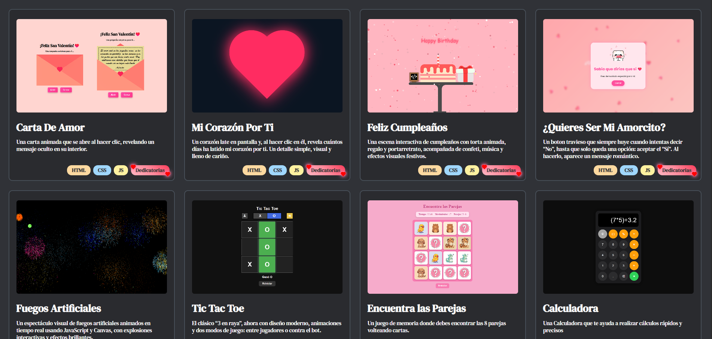

# Galería de Proyectos 🚀

## 🎬 Vista Previa

¡Explora todos los proyectos disponibles desde esta vista central!



---

## 📝 Descripción

Este repositorio contiene una **galería interactiva de proyectos** desarrollados y explicados por [DevBy_Lualmara](https://www.youtube.com/@DevByLualmara).

Cada tarjeta representa un mini proyecto creativo hecho con **HTML, CSS y JavaScript**. Al hacer clic en uno de ellos, serás dirigido a una carpeta con su código fuente completo y una demo funcional del mismo.

---

## 📁 Estructura

```plaintext
DevBy_Lualmara/
├── css/
│   ├── mobile.css
│   └── style.css
├── imagenes/
│   └── (imagenes usadas en los proyectos y portadas)
├── proyectos/
│   ├── Carta De Amor/
│   │   └── index.html, styles.css, script.js...
│   └── Feliz Cumpleaños/
│   │   └── index.html, styles.css, Confeti.js...
│   ├── Fuegos Artificiales/
│   │   └── index.html, styles.css, FuegosArtificiales.js...
│   └── (otros proyectos futuros)
└── index.html (Tablero principal)
```

## ¡Dame tu Apoyo!

Si te ha gustado este proyecto, no dudes en darme una ⭐ en el repositorio. ¡Eso me motiva a seguir creando contenido y mejorando mis proyectos!

¡Gracias por tu apoyo! 😊

---
